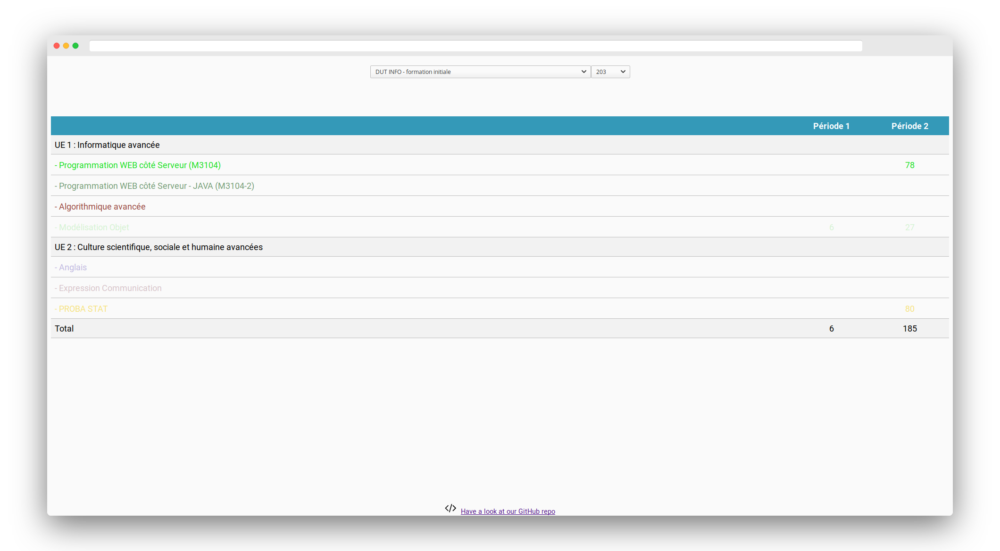

<h1 align="center">
    Teacher Organizer
</h1>

<p align="center">
    This is an Angular/Node.JS app which displays a simple table which you can use to organize your time as a teacher.
</p>



---
## Some context

This project was developed during a month as a school project for Paris Descartes University : it is the direct sequel of <a href="https://github.com/aenkirch/React-Big-Scheduler-Interface">this project</a> which we adapted from React to Angular, therefore, the DB used here is the same one given by our teacher, on which we made slight improvements in order to be able to use one subject during different periods.


---

## Features

<ul>
    <li>Selection of the training program and group to show the scheduler</li>
    <li>Drag-and-drop to move an event, save or delete event with live action on the DB</li>
    <li>Fully REST API with status codes adapted to requests on DB</li>
    <li>Confirmation of done action if one happened on DB displayed on a toast</li>
    <li>Handles the conflict between two events if happening at the same time</li>
    <li>Single page design </li>
    <li>Fully responsive</li>
</ul>

---

## Technologies used

**Back-end** : Node.JS <br />
**Front-end** : Angular 7 <br />
**Database** : MySQL <br />

**Some other ones** : Ng-Bootstrap, Angular-Draggable-Droppable, ngx-toastr, etc...

---

## Setup

First, make sure you run a MySQL server (use Wamp for example on Windows) on your computer and make sure Node.JS is installed.
If so : now install yarn by typing `npm install yarn -g`.

Now, go into the project folder and type `yarn install` to install the missing dependencies of the server side of the project, type `yarn install` again in the `client` folder to install the missing dependencies of the client side of the project.

Then, install the database by importing the `.sql` file in the project folder, go into the `server.js` file and at `line 13`, type the username, password, name, and the port you gave to your database.

```
    // Create connection
    const db = mysql.createConnection({
        host: 'localhost',
        user: 'root',
        password: 'password',
        socketPath: '/var/run/mysqld/mysqld.sock', //   comment out this line on non-Linux systems
        port: 3306,
        database: 'nodemysql_test'
    });
```


---


## Usage

<strong>yarn dev</strong> : type this command line when you've finished the setup section, it runs the server side of the project and the client side of the project at the same time to run the full app

<strong>yarn start</strong> : if you type this command line when you're either in the `/` folder of the project, it will run the server side of the project only, if you run it in the `/client` folder of the project, it will run only the client side of the project

---

## Structure of the project

The project is split in two parts : the **root** directory which is opened on the server side and the **client** directory which is opened on the client side.

Files opened on <strong>server side </strong> offer a REST API which communicates with the mySQL server : this REST API offers basic CRUD (Create/Read/Update/Delete) services.

Files opened on <strong>client side </strong> offer an interface in order for the user to launch actions on the database or just in order to see the scheduler.

---

## Architecture of the project

The project uses an **MVC** architectural pattern : 
<ul>
    <li>Model : it's the database which was provided by our teacher, it's connected to the controller</li>
    <li>View : what the user sees when he's accessing the website, it's the Angular code you can see in the /client folder</li>
    <li>Controller : the server side of the project (/ folder) and acts as a middleware between the Model and the View of the project</li>